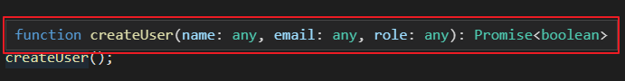
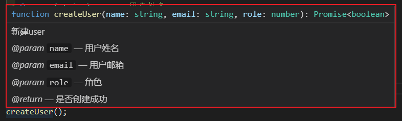

规则（must）
===========

这里列出的是明确的代码规范，告诉你什么写法是错误的，什么写法是正确的。

这些规范除极少数迫不得已的特殊情况外都必须被严格遵守。

# [目录和文件]

## 使用UTF-8字符编码，换行符为\n

基本上是共识了，没什么好说的

## 文件以换行符（\n）结尾

文件以换行符结尾的好处是做文件内容拼接的时候容易区分不同的文件

```
// 文件1的内容：
abcd

// 文件2的内容：
efgh

// 如果文件以换行结尾，则两个文件拼接后的内容是：
abcd
efgh

// 如果文件不以换行结尾，则两个文件拼接后的内容是：
abcdefgh
```

这其实是一个非常细节的地方，不过为了统一这里还是规定一下

## 一个文件的行数不得超过1千行（除constant）

代码行数可以大致反映复杂程度，这个规则主要是避免写出大泥球式的巨型组件、模块，因为他们很难维护

## 使用ES6 Modules而不是CommonJS

ES6 Modules见[文档](https://developer.mozilla.org/zh-CN/docs/Web/JavaScript/Reference/Statements/import)

ES6的模块系统是纯静态的模块系统，可以在编译阶段就完全确定模块依赖情况从而发现和排除很多问题，CommonJS是动态的模块系统，在编译阶段是无法完全确定代码的模块依赖情况的，比如CommonJS允许这样的写法：

```js
// require的包是动态决定的
const filePath = '../components/Dialog';
const Dialog = require(filePath);

// require行为是动态决定的
if (condition) {
  require('some-module')();
}
```

上面两种写法，只有在运行时才可以确定，ES6 Modules规范都是不允许的。

```js
// good
import a from 'some/module';

// bad
const a = require('some/module');
```

## import顺序必须按照第三方依赖、本地依赖、非js依赖的顺序排列，相同类型下常见的放前面不常见的放后面

这个规则主要是为了提升代码的美观程度，就好比写字，字写得好看和难看通常没有功能上的区别，但是有美学上的区别。

```js
// 先引入第三方依赖
import React from 'react';
import lodash from 'lodash';
// 然后引入本地依赖
import AComponent from './components/MyComponent';
import AnotherComponent from './components/AnotherComponent';
// 最后引入非js依赖
import styles from './styles.css';
```

## 一个React组件一个文件

这个规则的目的同样是为了避免写出大泥球式的代码，一个文件里的React组件越多，通常逻辑越复杂，越难以维护

有些人可能会觉得一个文件就放个几十行的组件会不会太浪费了，这个大可不必担心，新建文件不需要交钱也不会累skr人，不要在这上面节省。

## React组件使用default export，其他情况使用named export

因为React组件通常一个组件一个文件，所以用default export写起来比较符合直觉，其他情况下，比如util或constant应该用named export保证名字稳定

```js
// good
// React组件使用default export
export default MyComponent;
// constant和utils使用named export
export { xxxHelper, ACTIONS };

// bad
// React组件使用了named export
export { MyComponent };
// constant和utils使用了default export
export default { xxxHelper, ACTIONS };
```

# [注释]

## 注释符合JsDoc规范，尤其是函数和类型的注释

Javascript是动态类型语言，编辑器很难推导出代码中的类型信息，最简单的解决办法就是通过注释来补充说明。

[JsDoc](https://jsdoc.app/)本身是一个能根据代码注释自动生成文档的工具，其规定的注释风格能够被大部分主流IDE识别，因此我们的注释也应该符合JsDoc规范。

比如在VSCode中，没有当鼠标hover在一个没有注释的函数时，给出的函数信息非常少（如下图中红框区域）：



函数的第三个参数`role`是个什么东西呢？完全看不出来。

如果按照JsDoc格式补充了注释，就可以看到非常丰富的信息了（尤其是其中的类型信息）：



这下我们知道了，role是一个number，而不是string或object类型。

JsDoc规定了非常详细的注释语法，其实大部分语法都用不到，我们只要求在两个场景下的注释符合JsDoc规范。

1. 函数注释。尤其是有代码复用目的的函数，必须有注释。
2. 类型注释。尤其是接口请求数据和返回数据，必须有注释。

这是函数注释的例子：

```js
/**
 * 新建user
 * @param {string} name - 用户姓名
 * @param {string} email - 用户邮箱
 * @param {number} role - 角色
 * @return {Promise<boolean>} 是否创建成功
 */
async function createUser(name, email, role) {
  return true;
}
```

这是类型注释的例子：

```js
/**
 * 用户信息
 * @typedef {object} UserInfo
 * @property {string} name
 * @property {string} email
 * @property {number} role
 */

/**
 * @type {UserInfo}
 */
const user = { ... };
```

需要注意，Javascript的primitive type是小写单词，例如`boolean`,`number`,`string`,`symbol`,`null`。除此以外的类型是首字母大写单词，例如`Array`,`Promise`。具体的规则参考Google Closure Compiler文档中的[类型部分](https://github.com/google/closure-compiler/wiki/Types-in-the-Closure-Type-System#the-javascript-type-language)


## //必须接一个空格

这也是一个非常琐碎的细节，为了保持代码统一，这里明确一下。带有空格显得代码没有那么拥挤，相对稍微有利于阅读一些。

```js
// good
// 前面有一个空格

// bad
//前面没有空格
```

## disable eslint规则的地方都必须添加注释

如果disable eslint，那想必是有什么迫不得已的原因，如果没有说明为什么，未来其他人维护代码的时候就会非常困难，重构的时候都是坑。

```js
// good
// 这里禁用了camelCase的eslint检查，因为access_token之后会参与sql拼接，必须是snake_case
let access_token = ''; // eslint-disable-line camel-case

// bad
let access_token = ''; // eslint-disable-line camel-case

// even worse
let access_token = ''; // eslint-disable-line
```

# [命名]

## 常量名全大写，单词之间以`_`做分隔符

很基础的规则，没有太多可说的

```js
// good
const ROLE_HR = 'hr';
const USER_TYPE = 3;

// bad
const roleHr = 'hr'; // 没有用全大写
const USERTYPE = 3; // 没有_分隔，不好理解
```

## 函数名、变量名遵从小驼峰（lowerCamelCase）

小驼峰的意思是首字母小写的驼峰

很基础的规则，没有太多可说的

```js
// good
const userInfo = ...;
function updateUser() {
  ...
}

// bad
const user_info = ...;
function update_user() {
  ...
}
```

## 类名、组件名遵从大驼峰（UpperCamelCase）

大驼峰的意思是首字母大写的驼峰

很基础的规则，没有太多可说的

```js
// good
class UserSelector {
  ...
}

function UserSelector(props) {
  ...
}

// bad
class userSelector {
  ...
}

function userSelector {
  ...
}
```

## 路由名遵从蛇型（snake_case）

url是不区分大小写的，camelCase是依赖大小写存储信息的，因此用camelCase不太合适。

连字符`-`和下划线`_`二者其实没有太大差别，你看他们在键盘上甚至是共享一个按键的。

目前已知的一些区别有：

1. 文本分隔的效果。hyphen-example是无法双击选中整行的，lodash_example可以。

比如你可以尝试分别用鼠标双击下面的两个例子：

```
hyphen-example
lodash_example
```

一种说法是，`-`能让搜索引擎爬虫更好地分隔url，为页面打上标签，有利于SEO，不过我本人对这个说法持怀疑态度，搜索引擎应该不至于傻到这种程度。

2. 是否构成单词。比如`-`会参与某些单词的组成，比如front-end，但是`_`不会。因此如果用`-`的话，面对本身带`-`的单词可能会有麻烦。

比如shield.io就使用`-`做url编码的分隔符，格式为`{label}-{message}-{color}`，比如这样一个徽章：


因为徽章里的文本已经有`-`了，shields.io的解决办法是用两个`-`表示一个出现在单词中的`-`，略有些不便。

> 其实这里如果换成`_`做分隔符也会遇到同样的问题，这里只是举一个例子

3. 输入体验。`-`比`_`在输入的时候会略微容易一些，不需要按住shift，恰好`_`的按键和shift按键隔得比较远，很难单手操作。这对某些追求极致手速的开发者来说会带来不爽。

综上，在没有太多差别的情况下，我们就选择了`_`作为一个统一的标准，对，只是一个约定的标准，不要再问了，just do it

## default export class的文件名与class名保持一致，其他文件名遵从小驼峰

React组件因为是一个组件一个文件，所以有必要让组件名与文件名保持一致，这样更有利于理解和检索代码，比如：

```sh
# good
.
├── UserSelector.jsx
└── LocationPanel.jsx

# bad
.
├── user-selector.jsx
└── location_panel.jsx
```

对于非组件类型的其他文件，文件名命名规范与变量、函数一样，采用小驼峰。这个规则主要是为了减少大家的选择负担，与代码的默认命名方式保持一致。

```sh
# good
.
├── utils.js
└── dateFormatter.js

# bad
.
├── Utils.js
└── date_formatter.js
```

## 路由目录与路由名保持一致，组件目录名与组件名保持一致（大驼峰），其他目录名遵从小驼峰

目录的命名规范请参考“代码目录结构规范”，这里不做过多解释，遵守就是了。

假设项目的路由是 /user_info和/interview_setting
```sh
# good
.
└── pages/ # pages下目录名与路由保持一致
    ├── user_info/
    │   └── ...
    └── interview_setting/
        └── ...

# bad
.
└── pages/ # pages下目录名与路由没有保持一致
    ├── userInfo/
    │   └── ...
    └── interviewSetting/
        └── ...
```

```sh
# good
.
└── InterviewTable/ # 组件目录名与组件名保持一致（遵从大驼峰）
    ├── TableHeader.js
    ├── TableBody.js
    └── index.js

# bad
.
└── interviewTable/ # 组件目录名没有与组件名保持一致（遵从大驼峰）
    ├── TableHeader.js
    ├── TableBody.js
    └── index.js
```

```sh
# good
.
└── xhrTool/ # 其他目录名遵从小驼峰
    └── ...

# bad
.
└── xhr_tool/ # 其他目录名没有遵从小驼峰
    └── ...
```

## 目录名称都用单数（除非特别强调复数含义的）

英文名词复数可能有特殊形式，甚至有些名词是不可数的，这比较考验开发者的英文水平，但我们是在写代码不是在写英语作文，所以在没有特别强调复数含义的时候，都统一用单数，轻松加愉快。

与编程语言类似，自然语言也有糟粕，比如名词单复数变化规则不统一就是一种。

```sh
# good
.
├── constant/ # 目录名是单数
│   └── ...
└── util/
    └── ...

# bad
.
├── constants/ # 目录名不是单数
│   └── ...
└── utils/
    └── ...
```

## 动词统一用现在时（除非特别强调其他时态含义的）

英文动词时态千变万化，而且不同时态的写法也不一样，同样地，我们是在开发，不是在写英文作文，所以统一使用一般时态即可。

动词时态不规则变化同样也是语言的糟粕。

```js
// good
const updateAt = Date.now();
const changed = Date.now();

// bad
const updatedAt = Date.now();
const hasChanged = Date.now();
```

## 采用驼峰命名规则时禁止全大写某个单词

在驼峰规则里大小写是作为单词的分割的标记。例如：

```js
const userId = 1; // user + id
const sendHttpStatus = 0; // send + http + status
```

因此我们可以利用这个规则从驼峰式转换到其他形式：

```
userId <=> user_id
sendHttpStatus <=> send_http_status
```

如果其中有单词大写了，就会打破这个规则，转换的结果变为：

```
sendHTTPStatus <=> send_h_t_t_p_status
```

因此：

```js
// good
const candidateId = 1;
const htmlContent = '';

// bad
const candidateID = 1;
const HTMLContent = '';
```

## DOM节点的引用以`$`开头

在使用React时，通常是不需要直接操作DOM元素的，如果代码非常依赖对DOM操作，大概率是代码写的不够“React”，其他人理解代码的成本就会上升（不能再按照React的生命周期思考和理解代码逻辑）。

所以，这里规定对DOM元素的引用的名字前面都加一个`$`，目的是使代码逻辑更加明显，提醒维护者这段代码逻辑涉及DOM操作。

```js
// good
const $name = document.getElementById('name');

// bad
const name = document.getElementById('name');
```

## 禁止用2表示“to”、4表示“for”

2和4如果用来表示"to"和"for"，唯一的意义是少写几个字母，可是真的要表示"2"和"4"的含义的时候怎么办呢？比如`http2Status`，是`http to status`还是`http2 status`呢？

```js
// good
const httpToStatus = {};
function updateForHr() {
  ...
}

// bad
const http2Status = {};
function update4Hr() {
  ...
}
```

## 禁止用数字后缀的方式区分类似的变量

数字后缀的命名没有意义，对阅读和理解代码非常不友好。

```js
// good
const employer = { ... };
const employee = { ... };

// bad
const user1 = { ... };
const user2 = { ... };
```

## 禁止使用与系统API相同或是相像的名字

与系统API重名或者相似的命名，极易迷惑其他人，百害而无一利。所以这种做法非傻即坏。

```js
// good
class MyRequest {
  ...
}

// bad
class Request { // Request是浏览器环境的Fetch接口
  ...
}
```

## 名字的字面含义必须与实际相符

例如：
```js
// 函数看着像是return什么东西但是没有return
function getUserInfo() {
  ... // 没有return任何东西
}

// 变量看着像是object其实是个array
const user = [
  ...
]
```

我们称这种行为是“说一套做一套”，请不要这样，不然亲人会远离你，朋友会厌恶你。

## 禁止使用一个字母作为名字的变量（有特例）

先说特例，特例是`i`、`j`、`k`作为循环变量。这是约定俗称的，大家已经达成了共识，这么写不会对大家理解代码有什么干扰，所以没问题。

```js
for (let i = 0; i < candidates.length; i++) {
  ...
}
```

其他情况禁止使用单一字母做变量的名字，因为代码可读性很差，尤其是当代码逻辑变多以后。

# [格式]

## 必须使用分号

没有什么特殊的理由，就是单纯的规则。

```js
// good
const user = new User();

// bad
const user = new User()
```

## 2个空格为一个缩进单位

没有什么特殊的理由，就是单纯的规则，所有括号括起来的部分，都应该产生缩进

```js
// good
function foo() {
  return 0;
}

// bad
function foo() {
    return 0;
}
```

这里需要注意几个地方：

1. swtich的case也要缩进（因为有些eslint规则要求switch的case没有缩进，这种写法不符合这里的规则）

```js
// good
switch (status) {
  case 0:
    ...
  case 1:
    ...
  default:
    ...
}

// bad
switch (status) {
case 0:
  ...
case 1:
  ...
default:
  ...
}
```

2. 一个语句如果要换行，需要添加缩进

```js
// good
request('/api/demo')
  .get();

const status = (a && b)
  || c;

// bad
request('/api/demo')
.get();

const status = (a && b)
|| c;
```

## 禁止垂直对齐

所谓的垂直对齐指的是这种风格：

```js
const a   = 1;
const aa  = 2;
const aaa = 3;
```

甚至也会出现在注释里：

```js
/**
 * @param {number}     a - blablabla
 * @param {boolean[]}  b - blablabla
 */
```

看着确实美观，可读性好，但是容易产生额外的维护成本（比如某一项变量导致整体都要调整），有时候会产生额外的缩进，让一行变得更长，行内比较稀疏，反而不利于阅读了。所以不要使用垂直对齐的写法。

```js
// good
const a = 1;
const aa = 2;
const aaa = 3;

// bad
const a   = 1;
const aa  = 2;
const aaa = 3;
```

## 括号默认遵从K&R风格（特殊情况除外）

没有什么特殊的理由，就是单纯的规则。

```js
// good
function foo() {
  ...
}

if (condition) {
  ...
} else {
  ...
}

// bad
function foo()
{
  ...
}

if (condition)
{
  ...
}
else
{
  ...
}
```

所谓的例外，通常是一些字面量的定义，因为此时如果仍然使用KR风格，可读性并不会很好，用MS风格也是可以的。

```js
// 如果全部使用传统的KR风格，这里的缩进让人感觉很奇怪
const users = [{
  id: 1,
  name: 'a',
}, { // <--
  id: 2,
  name: 'b',
}];

// 如果内部使用MS风格，这里的缩进看上去就自然多了
const users = [
  {
    id: 1,
    name: 'a',
  },
  {
    id: 2,
    name: 'b',
  },
];
```

## 控制语句（if、else、for、do、while）、运算符两侧都必须有括号

没有什么特殊的理由，就是单纯的规则。这样做的好处是避免代码过于拥挤。

```js
// good
if (status === 0) {
  ...
}

// bad
if(status===0){
  ...
}
```

## 括号里不需要空格（花括号`{}`除外）

没有什么特殊的理由，就是单纯的规则。

```js
// good
const a = [1, 2, 3];
if (condition) {
  ...
}

// bad
const a = [ 1, 2, 3 ];
if ( condition ) {
  ...
}
```

## 箭头函数即使只有一个参数也要有括号

没有什么特殊的理由，就是单纯的规则。

```js
// good
const foo = (arg) => {
  console.log(arg);
}

// bad
const foo = arg => {
  console.log(arg);
}
```

## 用的时候再申明变量，而不是在一开始就申明

这样做可以让代码更紧凑，相关的代码在一起。

```js
// good
function foo() {
  ...
  const a = 1; // 下面要用到a了，此时申明变量
  if (a) {
    ...
  }
  ...
}

// bad
function foo() {
  const a = 1; // 函数一开头就申明了变量，到很后面才用到
  ...
  if (a) {
    ...
  }
  ...
}
```

## 申明变量时必须设置初始值

申明变量赋初始值就像是东西用完了放回原处一样，绝对是个好习惯。能够减少出bug的可能性。

```js
// good
const user = null;
const status = -1;

// bad
const user;
const status;
```

## 禁止一行出现多个语句或者一次申明多个变量

js里，一个语句可以占多行，同样地，多个语句也可以占一行（以分号分隔）
一行多个语句会降低代码可读性，添加注释也很困难，所以这种行为是被禁止的。变量申明也是如此。

```js
// good
const name = '';
const email = '';
const phone = '';

if (condition) {
  ...
} else {
  ...
}

// bad
const name = '', email = '', phone = '';

if (condition) { ... } else { ... }
```

## 一行代码不超过160个字符

一行的字符数太多会降低代码可读性，传统的80个字符的限制不是很合适，因为真的很容易超过，所以这里放宽到了160个字符。

例子就不用举了。

## 禁止连续空行

连续的空行会让代码变得稀疏，降低可读性。如果你具体的需要有多个空行区分不同的逻辑，那可以考虑重构成两个函数。

```js
// good
function foo() {
  ...

  ...
}

// bad
function foo() {
  ...


  ...
}
```

## 禁止行尾空格

行尾空格通常都是多余的，多余的东西没有存在的价值，留着还会显得乱。

建议配置IDE，在保存的时候自动清除行尾空格。

## 自定义callback的第一个参数是error

自定义回调函数的第一个参数是error，这是源自nodejs的写法约定。如果大家都遵从这个约定，有助于提升代码的可读性，而且可以做一些meta programming的。

```js
// good
function callback(err, arg1, arg2) { // 第一个参数位留给error
  if (err) { // 先处理error
    ...
  }

  ... // 然后是正常逻辑
}

// bad
function callback(arg1, arg2, err) { // err不是第一个参数
  ...
}
```

## 如果函数参数有callback，那么callback必须是最后一个参数

这也是源自nodejs的编程约定。

```js
// good
function sendRequest(value, type, callback) { // callback是最后一个参数
  ...
}

function sendRequest(callback, value, type) { // callback不是最后一个参数
  ...
}
```

# [语法、特性]

## 使用===，禁止使用==

大家都知道了，也就不多说了，js语言糟粕

```js
// good
if (a === b) {
  ...
}

// bad
if (a == b) {
  ...
}
```

## 使用const和let，禁止使用var

大家也都知道，也不多说了

```js
// good
const a = 123;
let b = '456';

// bad
var a = 123;
var b = '456';
```

## 优先使用arrow function，尤其是class property

箭头函数的this是静态绑定的，相比于普通函数行为更加可控也更容易理解，所以能使用箭头函数的地方都应该优先使用箭头函数。

```js
// good
const handler = (value) => {
  ...
}

class A {
  method: () => { // 尤其是class property，更应该使用箭头函数
    ...
  }
}

// bad
function handler(value) {
  ...
}

class A {
  method() {
    ...
  }
}
```

## 禁止在.map的callback带副作用

map应该是无副作用的，这是js甚至所有编程语言的约定，对js来说，如果想做有副作用的迭代逻辑，可以使用forEach。

副作用的意思是callback调用影响到了callback外面的状态。

如果大家都遵从这个约定，代码理解也会更容易，比如你看到一个forEach，那么脑海里立刻紧张起来了，因为你知道这里面有副作用，要小心，如果你看到map那就可以放松，因为map里面怎么折腾也不会影响到外面。

```js
// good
const items = [{ value: 1 }, {value: 2 }, { value: 3 }];
items.forEach((item) => {
  item.value = item.value * 2;
});

// bad
const items = [{ value: 1 }, {value: 2 }, { value: 3 }];
items.map((item) => {
  item.value = item.value * 2;
});
```

## 禁止使用eval和Function(...string)

eval和Function(...string)有XSS安全风险，禁止使用。

## 禁止magic number/string

magic number/string的问题有两个，一是代码可读性差，即使在每个使用的地方都加上注释也不见得合适，二是无法利用静态分析，写错（尤其是字符串）了无法在编译阶段被检测到，无法统计引用位置等。

有些人认为，仅在一个文件内部使用的number或string，没有共享的必要，因此不适合放在constant.js里，写成magic number/string也没什么问题。错！因为禁止magic number/string的目的不是为了代码复用，而是前面提到的两个缺点。如果没有共享的必要，你可以把常量就定义在所在文件里，不用非放在constant.js。

```js
// good
if (status === ERR_UNKNOWN) {
  ...
}

if (result === REQ_SUCCESS) {
  ...
}

// bad
if (status === 1938561) {
  ...
}

if (result === 'successs') { // 这里的success其实拼错了，但是很难发现
  ...
}
```

## 禁止使用undefined

`undefined`的含义是“未定义”，这是一个过于宽泛的概念，相当于“未知错误”，如果代码逻辑依赖undefined，那么代码本身的逻辑将变得很不可控而且难以理解。好的代码应该尽量清晰、明确，不要用undefined。

```js
// good
const result = null;

// bad
const result = undefined;
```

## 禁止使用常量做循环条件

这是一个比较保守的规则，目的是为了避免一些低级错误导致死循环。也许会给一些写法带来麻烦，但这个是可以接受的。

```js
// good
let done = true;
while (done) {
  ...
}

// bad
while (true) {
  ...
}
```

## 变量的初始值必须与类型匹配

申明变量的时候需要赋初值，初值应该与变量类型保持一致，比如一个变量被用来保存number类型的数据，那么初始值就应该也是number。

这个规则可以避免一些因初始值类型不对导致的诡异bug。

```js
// good
let count = 0; // number类型初值
let message = ''; // string类型初值
let user = null; // 引用类型初值

// bad
let count = null; // number类型初值是null
let message = null; // message类型初值是null
```

## 禁止改变变量的类型

变量的类型在申明后就一定不能修改，否则极易产生bug，尤其是在多人写作的大型项目里。

```js
// bad
let result = 0;

...

result = ''; // 变量类型从number换成了string

...
```

## 禁止一个函数返回不同类型的结果

函数返回不同类型的数据会让代码难以维护。

```js
// good
function foo() {
  if (condition) {
    return Promise.resolve(-1);
  }

  return Promise.resolve(1);
}

// bad
function foo() {
  if (condition) {
    return null; // 这里直接return了一个null，不是Promise类型
  }

  return Promise.resolve(1);
}
```

## 禁止在函数参数中使用rest操作符

rest操作符会让代码的可读性下降，且无法利用静态检查，虽然能让代码简洁一些，但是维护成本急剧升高。

```js
// good
function foo(err, arg1, arg2, arg3) {
  callback(arg1, arg2, arg3);
}

// bad
function foo(err, ...rest) { // 其他人看到foo这个函数完全不知道接受什么参数，必须去看callback的定义才行
  callback(...rest);
}
```

## 禁止拼接得到函数名

拼接函数名的例子：

```js
const eventHandler = handlers['on' + eventName];
eventHandler();
```

问题是，拼接函数名字这种写法无法利用静态分析方法提前发现错误，而且代码逻辑比较脆弱，容易产生bug。

```js
// good
let eventHandler = () => {};
if (eventName === 'click') {
  eventHandler = handlers.onclick;
}

// bad
const eventHandler = handlers['on' + eventName];
```

## 禁止私自修改依赖库的行为

私自修改依赖库的行为（比如扩展已有方法或新增方法）有两个问题：

1. 会让其他维护代码人感到迷惑。因为这是一个非常隐晦的动作，其他人完全不知道依赖库的行为变了，变成什么样了、在哪变的都不清楚。
2. 会让依赖库的升级迁移变得困难。时间久了就变成一个阻碍技术栈升级的坑。

所以，通常情况下是禁止扩展依赖库行为的。

```js
// bad
import RcTable from 'rc-table';

RcTable.customLogic = () => { // 这里给RCTable注入了一个自定义方法
  ...
}
```

即使迫不得已需要扩展依赖库的行为，也千万不要在代码里直接修改，推荐的做法是fork依赖库代码，然后重新发包。这样一来做了哪些改动、谁做的改动都相对更加清楚，相对更容易维护。

## 禁止修改prototype

js的原型链继承比较隐晦，而且是动态特性无法被编译器识别，难以维护。绝大部分情况下都不需要修改prototype，所以禁止修改。

```js
// bad
String.prototype.utils = function() {
  ...
}
```

## 禁止对类对象使用spread操作符

因为spread操作符只会对对象的[own enumerable properties](https://developer.mozilla.org/en-US/docs/Web/JavaScript/Enumerability_and_ownership_of_properties)生效，也就是Object.keys或for...in能得到的properties。

如果你操作的对象是由普通的object literal构造得到的，那就没有问题，否则就可能得到意料之外的结果。

```js
// good
const a = new Util();
const b = Object.assign(a, { foo: () => {} }); // 需要使用Object.assign

// bad
const a = new Util();
const b = { ...a, foo: () => {} };
```

## 禁止抛出Error以外的东西

这是一个常识，只有Error类型的对象才可以抛出，以便异常捕获能够正常获取到Error相关的信息，例如函数栈、错误信息等。

```js
// good
throw new Error('hahaha');

// bad
throw 'hahaha';
```

如果你想在抛出的Error对象里注入一些东西，注意不能写错：

```js
// good
throw Object.assign(new Error('hahaha'), { context: {} });

// bad
throw { ...new Error('hahaha'), context: {} };
```

原因见上一条。

## 禁止擅自引入新的stage-x特性（必须与leader沟通讨论）

js的实验特性非常不稳定，无论是语法还是效果，随时有可能发生改动，这些特性在个人小项目里玩玩是没问题的，但是在大型企业级项目里是不允许的，因为会增加维护成本。

此外babel插件越多，越难以迁移到typescript。

## 禁止擅自引入npm包（必须与leader沟通讨论）

node生态的优点是繁荣，但是同时带来的巨大缺点是低质量。大量垃圾package充斥在npm里，引入一个低质量的包（代码质量差或者不维护）简直后患无穷，甚至会成为阻碍技术栈升级的罪魁祸首。

此外还有一个问题是，有些包大而全，但我们只用到其中一小部分的功能，导致前端代码打包的时候体积过大。

在个人项目或者快速开发时期，引入一些包解决现成的问题是合适的做法，但是一旦项目变大了，需要长时间维护的时候，引用第三方包就必须要慎重，必须与对应leader讨论才行，禁止随意引入。

# [React]

## 组件用到的props必须有propTypes

propTypes虽然无法起到强制类型检查的效果，但是至少能让维护组件的人知道组件的用法，提升代码可读性。

```js
// good
class MyComponent extends React.Component {
  static propTypes = {
    ...
  }

  ...
}

// function组件也需要写propTypes
function MyComponent() {
  ...
}

MyComponent.propTypes = {
  ...
};
```

## 组件的props必须按照样式、配置、数据、动作的顺序排列

这个规则主要是为了提升代码整洁程度，从而有利于阅读和理解代码。

一个组件可能有许多props，根据他们的用途（或者说类型）大致分成了4类：

1. 样式相关。比如style对象、className等，这种属性很通用使用频率也很高，所以放在第一个。
2. 配置相关。比如disable、mode等，通常会是一些boolean类型的props。这种属性通常比较重要，所以放在第二个。
3. 数据相关。比如data、value等。React单向数据流中的“数据向下”，指的就是这些属性。
4. 动作相关。比如onChange、onSubmit、onClose等触发动作，都是function类型。React单向数据流中的“动作向上”，指的就是这些属性。

```js
// good
<DepartmentSelector
  className="container"
  activeClassName="active"
  collapseMode={true}
  showLines={true}
  visibleCount={30}
  valueRenderer={valueRenderer}
  departments={allDepartments}
  onClick={onClick}
  onAddDepartment={onAdd}
/>

// bad
<DepartmentSelector
  departments={allDepartments}
  onClick={onClick}
  valueRenderer={valueRenderer}
  showLines={true}
  className="container"
  collapseMode={true}
  activeClassName="active"
  visibleCount={30}
  onAddDepartment={onAdd}
/>
```

如果组件的props都能遵守这个规则，不但看着整洁，找东西也更容易。

## event handler函数以on*命名

因为这样更符合传统，看着更顺眼。

```js
// good
<MyComponent onClick={...}/>

// bad
<MyComponent handleClick={...}/>
```

## 禁止在render函数中产生副作用

带副作用的render函数是各种bug的源泉

```js
// very bad
render() {
  setInterval(() => {
    ...
  }, 1000);
}
```

## 禁止直接修改this.props或this.state

这两种行为非常危险，容易产生bug，而且出了bug极难定位，非常浪费时间。

其实大多数人都知道这个道理，但是需要注意的是，有些时候你可能是不经意间违反了这个规定（间接修改），比如：

```js
const { config } = this.props;
...
...
config.something = blablabla; // 这里看上去改的是config，实际上改动影响到了this.props
```

这个需要开发者非常小心，千万不要这样。

就算你知道这样做不会有什么问题，也绝不要这样做，因为现在没问题不代表以后没问题，你知道这样做没问题不代表其他人不知道这样做没问题。

## 禁止使用spread操作符给组件传参

spread形式传参虽然写起来省劲儿，但是最主要的问题是无法看出传了什么东西，是非常动态的写法。比如这样一段写法：

```js
<MyComponent {...props}/>;
```

MyComponent到底传了什么props呢？完全无法得知，必须向上追溯到props的定义才行。

如果其他开发者向props里增加了一些field，这些新增的props就会随着spread操作符一起传递到了MyComponent组件里，万一恰好shadow了某个有用的属性，bug就产生了，而且非常难以发现。有时候甚至会产生XSS漏洞（比如外部注入了一个dangerouslySetInnerHtml的属性）

总之就是非常不利于维护。

```js
// good
<MyComponent value={this.props.value} options={this.props.options} onChange={this.props.onChange}/>

// bad
<MyComponent {...this.props}/>
```

## 禁止UGC业务使用dangerouslySetInnerHTML

dangerouslySetInnerHTML有XSS风险。

```js
// bad
<div dangerouslySetInnerHTML={{ __html: '' }}/>
```

## 禁止使用数组索引做key

数组索引做key容易导致bug，比如删除数组中某一项无法触发update。即使明确知道index做key没有问题也不要用index做key，因为其他维护者在修改代码的时候可能遇到问题。

```js
// good
users.map((user) => {
  return <li key={user.id}>{user.name}</li>;
})

users.map((user, index) => {
  return <li key={index}>{user.name}</li>;
})
```

## 禁止不必要的jsx嵌套

既然没必要，就不应该出现。

```js
// good
<div>
  hello, world
</div>

// bad
<div>
  <div> <!-- 这里的div是没有必要的 -->
    hello, world
  </div>
</div>
```

## redux action必须遵守FSA标准

既然有标准，就应该遵守：
[FSA(Flux Standard Action)标准](https://github.com/acdlite/flux-standard-action)

```js
// good
dispatch({
  type: UPDATE_USER,
  payload: {
    ...
  },
});

// bad
dispatch({
  type: UPDATE_USER,
  users: allUsers, // 数据没有放在payload里
})
```

# [样式]

## 样式属性必须按照定位、盒模型、文字、其他的顺序排列

这个规则同样是为了提升代码整洁程度，有利于阅读和理解代码。

根据功能和常用程度，我们把CSS样式大致分成了4类

1. 定位。比如position、left、top、z-index等。定位属性非常常见，而且对元素的样式影响非常重要，所以放在第一位。
2. 盒模型。比如display、box-sizing、width、height、padding、margin等。盒模型属性也非常常见，而且对元素的样式影响也非常大，这里排在第二位。
3. 文字样式。比如font-size、line-height、color等。文字样式也是比较常见的样式，排在第三位。
4. 其他样式。比如background、border、shadow等。这些样式不如前面的样式使用得频繁，排在最后。

```css
/* good */
.message {
  position: absolute;
  left: 200px;
  z-index: 5;
  box-sizing: border-box;
  width: 300px;
  height: 200px;
  padding: 10px 14px;
  margin: 20px;
  font-size: 22px;
  color: #FCFCFC;
  border-radius: 4px;
  border: 1px solid #ECECEC;
}

/* bad */
.message {
  color: #FCFCFC;
  border-radius: 4px;
  margin: 20px;
  position: absolute;
  width: 300px;
  height: 200px;
  border: 1px solid #ECECEC;
  left: 200px;
  box-sizing: border-box;
  padding: 10px 14px;
  font-size: 22px;
  z-index: 5;
}
```

## 选择器命名使用kebab-case

因为CSS中的属性就是kebab-case，应该保持风格统一。

```css
/* good */
.message-body {
  font-size: 20px;
}

/* bad */
.messageBody {
  font-size: 20px;
}

.message_body {
  font-size: 20px;
}
```

## 必须使用CSS Modules

CSS Modules能够有效防止CSS样式污染的问题，除非一些极其common的样式（比如normalize.css）外，都应该使用CSS Modules

CSS Modules的命名方式为，js中使用驼峰命名，推荐使用最基本的引入方法，即：

```js
import styles from './component.css';

<div className={styles.container}>hello</div>
```

有些人喜欢用css bind引入样式，比如：

```js
import classNames from 'classnames';
import styles from './component.css';

const cx = classNames.bind(styles);

<div className={cx('container')}>hello</div>
```

这种方式显得比较乱，容易混合camelCase和kebab-case，而且属于动态写法无法利用静态分析的工具，此外从写法上讲并没有简化多少，总之不推荐。

## 默认使用box-sizing: border-box

border-box更直观，非特殊情况一律使用border-box

这个规则通常会被内置到normalize.css中，比如

```css
* {
  box-sizing: border-box;
}
```

所以开发过程中通常不需要在意。

## 禁止使用tag做选择器

禁止使用tag选择器有三个原因：

1. tag选择器可读性差

比如下面的例子：

```css
.message > span > div {
  ...
}
```

这是要匹配什么元素？令人迷惑，也不敢轻易修改，几乎是无法维护的代码。

2. DOM结构容易产生变化，不是很稳定，因而tag选择器也不够稳定。

比如下面的例子，对.message下的span标签增加样式：

```css
.message > span {
  ...
}
```

如果其他维护者将DOM的span改成了div，那么样式就丢了。又或者其他维护者在span里又增加了一层span，那么也会被匹配到，产生非期望的效果。

3. tag选择器无法利用CSS Modules

由于无法被CSS Modules覆盖，所以就有污染全局样式的可能。

所以，禁止用tag选择器。凡是用tag选择器的地方通常都可以用class选择器代替。

```css
/* good */
.message > .body > .title {
  font-size: 20px;
}

/* bad */
.message > span > div {
  font-size: 20px;
}
```

## 禁止使用!important

`!important`是CSS中的毒品，简单粗暴效果立竿见影，用着贼爽，所以很容易成瘾导致被滥用。多少优秀的开发者也知道滥用!important是不对的，但是就是忍不住。

滥用!important的危害有两个：

1. 它会导致样式完全无法扩展。因为没有办法覆盖了。

2. 一旦important侵入代码，再要想去掉非常困难（因为去掉!important会在哪里造成什么影响是不可知的）。

不要有侥幸心理，现实生活对毒品的打击力度多大，CSS中对!important的打击力度就有多大。

有人会问了，我用!important就是为了覆盖样式，如果不让写!important该怎么办呢？答案是增加class提示选择器的优先级。

```css
.message.prior-fix { /* 这里的prior-fix就是为了提升选择器的优先级 */
  ...
}
```

## 禁止不必要的选择器嵌套

开启了CSS Modules后，不用再担心CSS全局样式污染的问题。嵌套选择器的做法除了不必要地增加了选择器的优先级之外，没有任何意义。

```less
// good
.message-title {
  ...
}

// bad
.message {
  .title { // 这样会使这个选择器的优先级是两个class，当其他人想要覆盖的时候就得用三个class才行...
    ...
  }
}
```

## 禁止使用stylus的&拼接选择器

用`&`拼接选择器是一种动态的行为，会使代码变得琐碎，很难理解和定位。

过去，我们使用BEM命名规则，class通常都很长，使用`&`辅助拼接可以在开发上提示不少效率，但是开启CSS Modules后，class名字可以写得很短，而且也没有要在包含namespace信息了。使用`&`带来的收益就很小了。

比如像下面的代码，几乎无法看出完整的class是什么，维护起来非常困难，想要搜索`.message__body__title`，直接在代码中检索是搜不到的。

```stylus
// bad
.message
  &__body
    &__title
      ...
    &__content
      ...
  &__footer
    &__action
      ...
}
```

正确的做法是：

```stylus
.message-body-title
  ...

.message-body-content
  ...

.message-footer-action
  ...
```

## 禁止使用float做定位

float属性被发明出来是用来做图文混排的，不是用来做定位的。此外，float属性有很多副作用，要想正常使用往往还要熟悉各种清除浮动的方法。

过去在浏览器兼容性较差的时候，我们用float做定位那是迫不得已。现在环境改善很多了，再用float做定位非傻即坏。

多用flex。

```css
/* good */
.message {
  float: left;
}

/* bad */
.message {
  position: absolute;
  left: 0;
}
```

# [网络]

## 自定义HTTP头部必须以X开头

这是规范，没什么好商量的。
